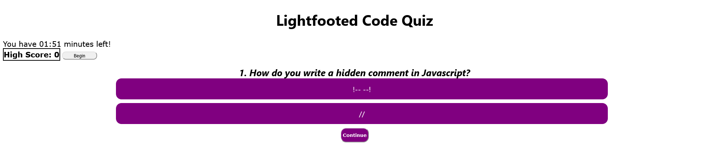
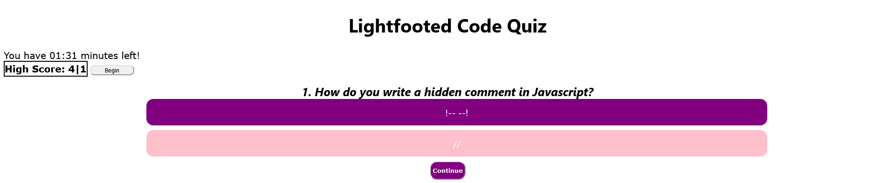
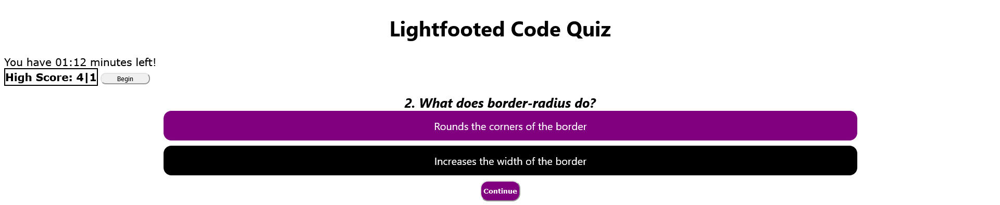

# Code Quiz

## Description
A quiz of 4 questions and 2 multiple choice answers. Timer and questions will not start or show until Begin next to score card is pressed. Correct answers will be marked in pink while incorrect answers will be marked in black. Once a choice is made, you cannot change your answer.

## Web Link
[Start Quiz!](https://lightfooted.github.io/quiz-challenge/)

## Screenshot

On page load

Questions and choices show with the count down timer

Pink if answer is correct

Black if answer is wrong

Results

### Additional Notes
This is missing more proper functionality. No ability to store user initials. No challenge for the user if wrong answer is chosen. Ex. -minus 10secs to timer if inccorrect.